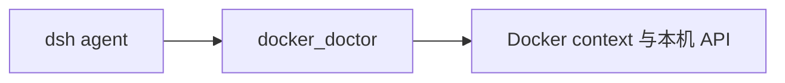

# dsh-wsl-docker

> **套件安装：** 见 [dsh-wsl-kit](https://github.com/173787247/dsh-wsl-kit)。推荐 `KIT_SET=daily` | `llm` | `github` | `full`。故障树：[TROUBLESHOOTING.zh.md](https://github.com/173787247/dsh-wsl-kit/blob/master/docs/TROUBLESHOOTING.zh.md)。

DeepSeek Harness 插件：Docker Desktop vs WSL 引擎诊断，并提示 **vLLM / OpenAI :8000** 容器。

[English → README.md](./README.md)

## 在套件里的位置

区分 Docker Desktop 和 WSL context，并判断本机推理端口是不是真的 API 就绪。



整套关系图和版本快照：[dsh-wsl-kit 中文说明](https://github.com/173787247/dsh-wsl-kit/blob/master/README.zh.md)。本插件是 **0.2.2**（full，也在 llm）。不要把那份总表抄进本 README。


## 兼容性

| 项 | 值 |
|----|----|
| **插件** | `dsh-wsl-docker` **0.2.2** |
| **最低 dsh** | ≥ **0.1.2**（Windows 中继 `:3081` 一次性 `?token=`） |
| **最新验证** | 以 [dsh-wsl-kit 兼容性](https://github.com/173787247/dsh-wsl-kit#compatibility-2026-09) 为准（当前 **`0.1.7-alpha.2`**）— 套件唯一真源 |
| **套件档位** | `llm` / `full`（也可单独装） |
| **云端 Flash** | settings / `llm-deepseek` 使用 **`deepseek-flash`**（V4.1 Flash）；本插件不配置模型 id |
| **Agent Teams** | 上游实验包；本插件不依赖 |

套件版本地板：[`check-plugin-versions.sh`](https://github.com/173787247/dsh-wsl-kit/blob/master/scripts/check-plugin-versions.sh)。故障树：[TROUBLESHOOTING.zh.md](https://github.com/173787247/dsh-wsl-kit/blob/master/docs/TROUBLESHOOTING.zh.md)。

## 做什么

工具 **`docker_doctor`**：

| focus | 作用 |
|-------|------|
| `all`（默认） | daemon/context + 列出容器 + vLLM 提示 |
| `daemon` | 只看 CLI / context / server |
| `vllm` | 筛疑似 vLLM/OpenAI/:8000 的容器 |

有 daemon 时还会看 nvidia runtime 是否明显。`baseURL` 仍用 [`host_reach`](https://github.com/173787247/dsh-wsl-hostsvc)（`profile=vllm`）。

示例（需 GPU 与镜像权限）：

```sh
docker run --gpus all -p 8000:8000 vllm/vllm-openai:latest --model <HF_ID>
```

然后在 dsh 会话里：`host_reach` → 粘贴 `providerSnippets`；`export VLLM_API_KEY=vllm`。

## 安装

```sh
# 已含在 KIT_SET=llm / full
dsh plugin --profile web add github:173787247/dsh-wsl-docker
```

重启 `dsh web`，开新会话。

## 许可

MIT
